## プロジェクトURL
https://firstgram-1b4ce.web.app/login/

## プロジェクトタイトル
firstgram

## プロジェクトの概要
snsの画像投稿アプリを作成(instagram参考)

## 使用言語
- React
- 状態管理(hooks)
- TypeScript
- scss(BEM)
- Firebase(Firestore Database,Storage,Authentication)
- Docker

### 機能一覧
- 画像・キャプションの投稿機能
- 投稿された画像・キャプションの閲覧機能
- 投稿の編集/削除機能
- 新規ユーザー登録機能
- ログイン/ログアウト機能
- 投稿に対するいいね機能
- 投稿に対するコメント機能
- ダイレクトメッセージ機能
- フォロー機能
- 登録ユーザーの検索機能
- 投稿の保存機能
- プロフィール編集機能

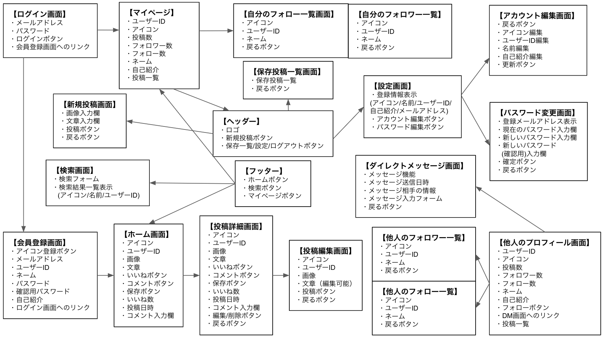 

## ブランチ運用
- main          : リリース用のソースコード
- develop       : 開発中のソースコード
- feather/機能名 : 各機能のソースコード

## ディレクトリ構造
<pre>
.
├── Dockerfile
├── README.md
├── docker-compose.yaml
├── firebase.json
├── package-lock.json
├── package.json
├── public
├── src
│   ├── App.tsx
│   ├── component
│   │   ├── atoms
│   │   │   ├── Input
│   │   │   ├── button
│   │   │   ├── icon
│   │   │   ├── pictures
│   │   │   └── user
│   │   ├── molecules
│   │   ├── organisms
│   │   ├── pages
│   │   └── utils
│   ├── css
│   ├── firebase.js
│   ├── index.css
│   ├── index.tsx
│   ├── rootReducer.ts
│   ├── sass
│   │   ├── component
│   │   │   ├── atoms
│   │   │   │   ├── button
│   │   │   │   ├── icon
│   │   │   │   ├── input
│   │   │   │   ├── pictures
│   │   │   │   └── user
│   │   │   ├── molecules
│   │   │   ├── organisms
│   │   │   ├── pages
│   │   │   └── templates
│   │   ├── foundation
│   │   ├── global
│   │   │   ├── mixin
│   │   │   └── setting
│   │   ├── style.css.map
│   │   ├── style.scss
│   └── types
│       └── types.ts
└── tsconfig.json
</pre>

- コンポーネントの切り分けはatomicデザインを意識して作成

## プロジェクトの画面一例
### ログイン画面
[pc]
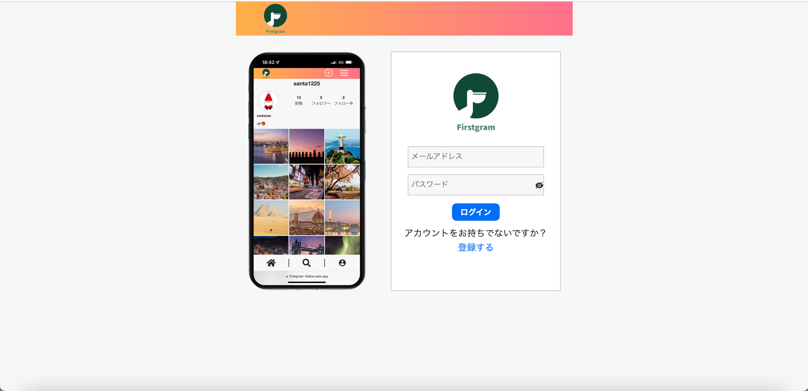 

[phone]

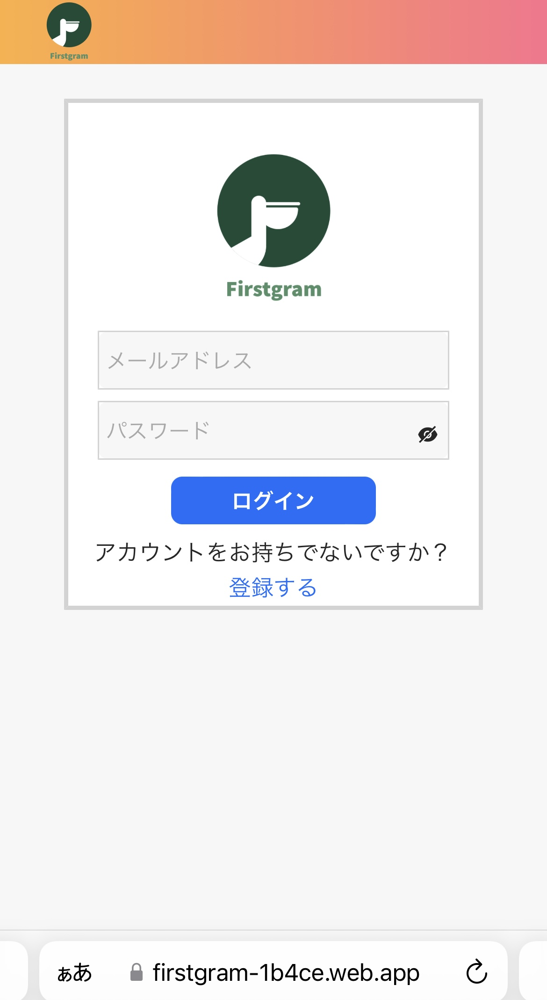

### 投稿一覧画面
[pc]
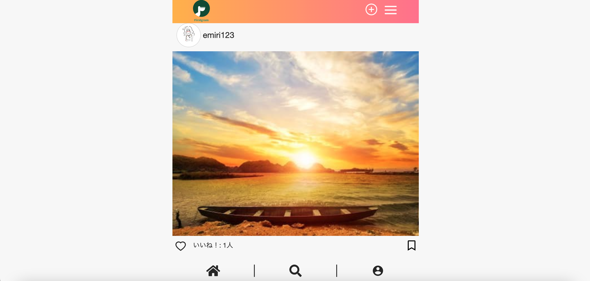

[phone]

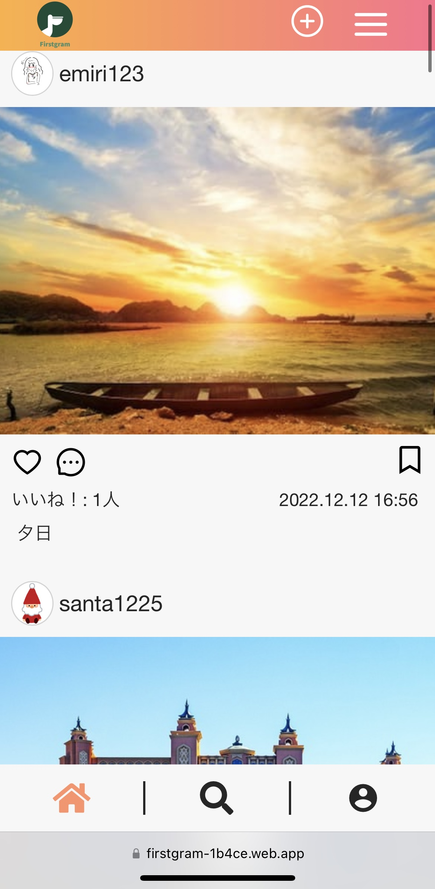

### マイページ
[pc]
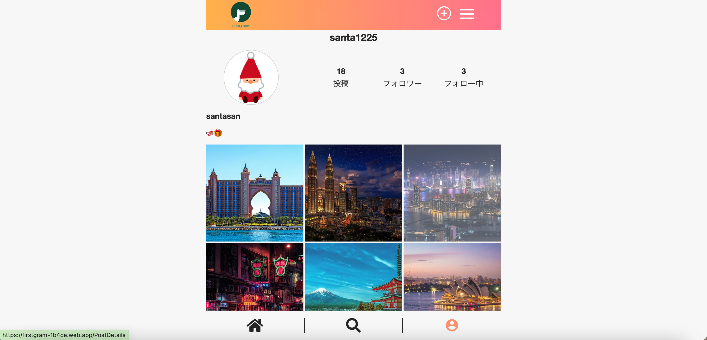 

[phone]

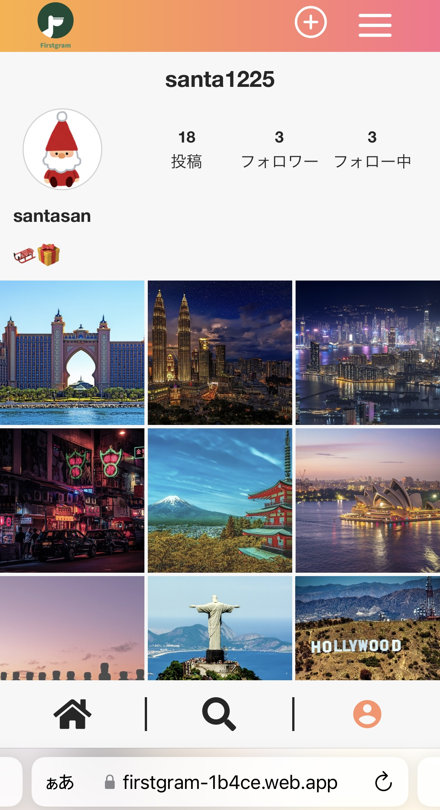

### ダイレクトメッセージ画面
[pc]
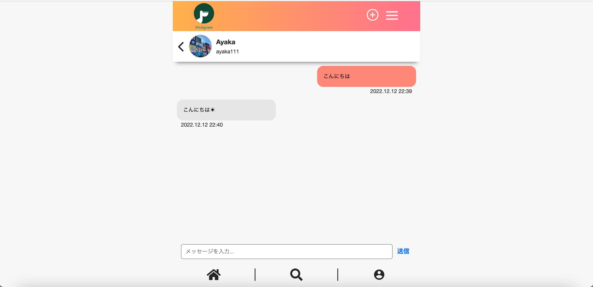

[phone]

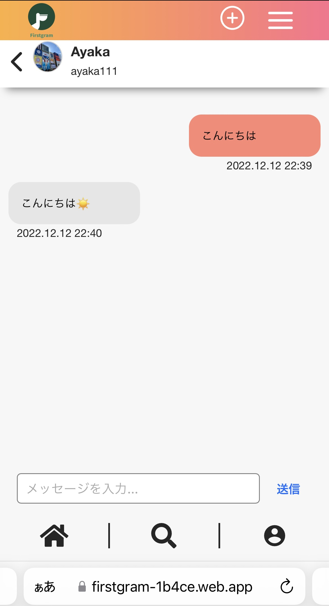

### ユーザー検索画面
[pc]
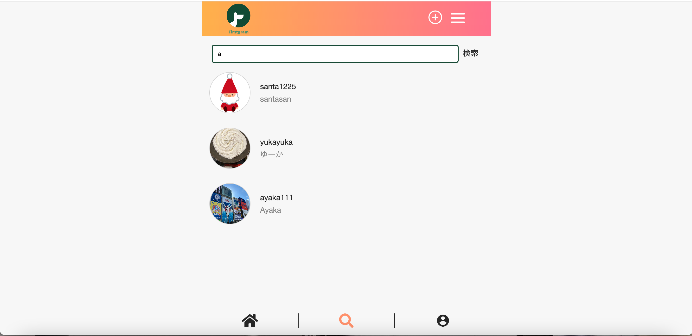 

[phone]

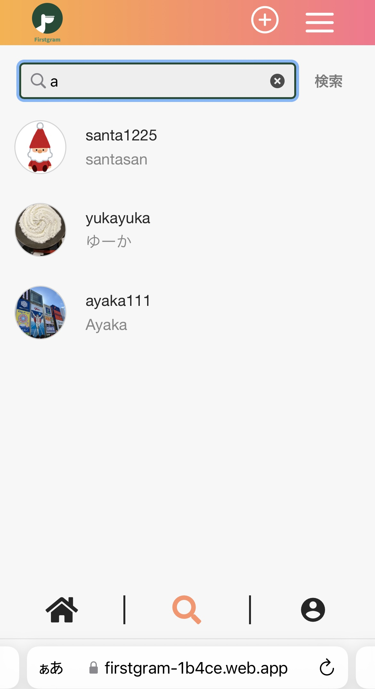 

